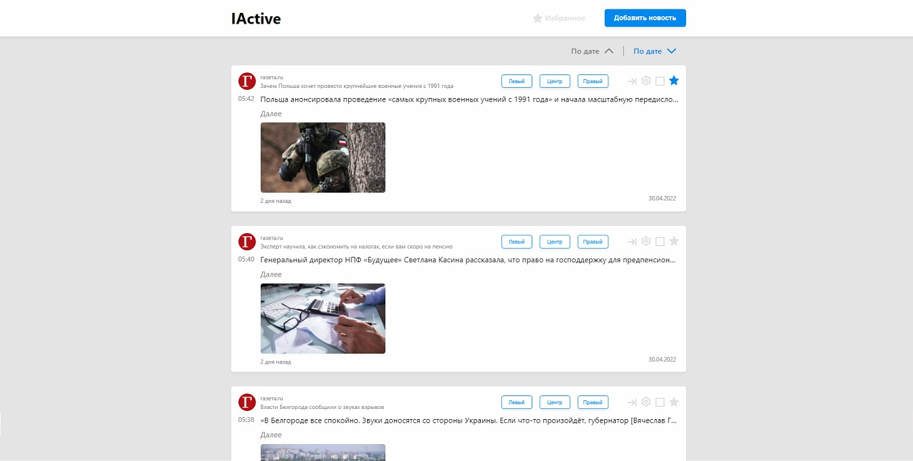
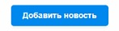
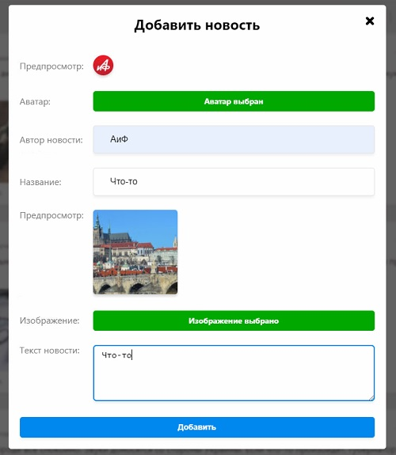
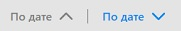
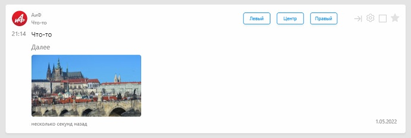
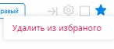

# IActive react-app

* [Описание проекта](#описание-проекта)
* [Запуск проекта](#запуск-проекта)

* :file_folder: `Client` на ReactJs/TypeScript/Redux Toolkit/Socket io
* :file_folder: `Server` на Express/MongoDb/Socket io

## Описание проекта

* Кнопка `Добавить новость` открывает модальное окно

* После заполнения всех полей и нажатия кнопки `Добавить` 
новая карточка добаляется в конец или начало , 
в зависимости от установленной `сортировки` 

* Кнопка  добавляет в `избранное`
после чего при наведении появляется возможность удалить из избранного
  

* При наведении на кнопку настроек появляется окно настроек
с возможностью `изменения` карточки (по аналогии с добавлением),
а также `удалить` карточку
* При нажатии на кнопку `Далее`
осуществляется переход к страницу сполной информацией карточки

* Избранное хранится к куках, срок жизни кук один год.
* Для каждого пользователя своё избранное.
* Сортировка по дате добавления `вверх/вниз`
* На мобильных устройствах поя вляется мобильное меню  в него
перемещается кнопка `Избранное` и кнопка `Добавить новость`
* Для подключения к бд создать файл `.env` по аналогии с `.env.example`

## Запуск проекта

В проекте находятся две папки `client` и `server`:

Запуск сервера :
* Перейдите в папку `server` из корневой дериктории проекта `cd server`
* Запуск сервера `npm run dev`
* Сервер запускается на  `http://localhost:5000`

Запуск клиента :
* Перейдите в папку `client` из корневой дериктории проекта `cd client`
* Запуск сервера `npm run start`
* Клиент запускается на  `http://localhost:3000`

Доступные срипты:
* Для коиентской части `npm run stylelint` запускает линтер стилей `scss`.
* Для коиентской части `npm run lint:fix` запускает линтер `eslint`.
* Для коиентской части `npm run build` собирает проект для продакшена

